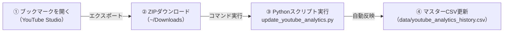

# YouTube アナリティクス データ更新運用フロー

YouTube Studioからエクスポートしたアナリティクスデータを、ローカル環境で安全かつ迅速にクレンジング・マージ・履歴管理するための運用手順書です。

---

## 1. 概要とセキュリティ設計

### 本運用の目的
- YouTube Studioからのエクスポートデータに対する「不要行削除」「日付変換」「降順ソート」「サムネイル・備考履歴の引き継ぎ」を**ワンクリック＋ワンコマンド**で自動化します。
- スプレッドシート等での手作業による転記ミスやフォーマット崩れを防止します。

### セキュリティ & プライバシー設計
- **アカウント認証・API不使用**:
  Googleアカウントの認証情報（ID/パスワード/トークン）やAPIキーは一切使用・保存しません。アカウントロックやCookie漏洩のリスクは完全ゼロです。
- **機密データのGit除外**:
  チャンネルの実績数値（再生数・CTR・収益等）が記録される `data/` ディレクトリおよびすべての `.csv` ファイルは、`.gitignore` により**ローカル環境のみに保持され、GitHubには送信・保存されません**。

---

## 2. 初回セットアップ（指標プリセットの保存）

YouTube Studioの詳細モードで必要な指標を一度セットしたURLをブラウザにブックマークしておくことで、次回以降**開くだけで同一の指標一覧が復元**されます。

### セットする14指標一覧
1. コンテンツ（動画ID）
2. 動画のタイトル
3. 動画公開時刻
4. 長さ
5. YouTube Premium の視聴回数
6. 高評価数
7. 登録者増加数
8. エンゲージ ビュー
9. 平均視聴時間
10. 視聴回数
11. 総再生時間（単位: 時間）
12. チャンネル登録者
13. サムネイルのインプレッション
14. サムネイルのクリック率 (%)

### ブックマークの登録手順
1. チャンネル管理権限を持つブラウザプロファイルで、YouTube Studioの **「アナリティクス」>「詳細モード」** を開きます。
2. 期間設定を **「全期間（ライフタイム）」** に設定します。
3. 表の右端にある **「＋（指標を追加）」** より、上記指標を選択して表示させます。
4. この状態のブラウザURL（指標パラメータ付きURL）をブックマークに登録します（例: `ポモスタ分析CSVエクスポート`）。

---

## 3. 日常の更新作業フロー（3ステップ）



### ステップ①：エクスポート
1. 登録したブックマークを開きます。
2. 画面右上の **「エクスポート」>「カンマ区切り値 (.csv)」** をクリックします。
3. ダウンロードフォルダ（`~/Downloads/`）に `コンテンツ YYYY-MM-DD_YYYY-MM-DD ....zip` が保存されます。
   > [!NOTE]
   > ダウンロードしたZIPファイルを手動で解凍・移動・リネームする必要はありません。そのままの状態で次へ進みます。

### ステップ②：自動更新コマンドの実行
ターミナルを開き、プロジェクトのルートディレクトリで以下を実行します：

```bash
python3 scripts/update_youtube_analytics.py
```

- スクリプトが `~/Downloads/` 内の最新エクスポートファイル（ZIPまたはCSV）を自動検出し、内部の「表データ.csv」を直接読み込んで自動マージします。
- 更新直前のデータは `data/backup/youtube_analytics_history_YYYYMMDD_HHMMSS.csv` に自動退避されます。

### ステップ③：差分確認と手動項目の入力
スクリプト実行後、新規公開動画が存在する場合はコンソールに以下のように通知されます：

```text
⚠️ 【新規動画が追加されました】
以下の動画はサムネイル列（初期サムネイル / 最終サムネイル）が未設定です:
  - [VIDEO_ID] YYYY/MM/DD | 動画タイトル...
```

- `data/youtube_analytics_history.csv` を開き、該当動画の **「初期サムネイル」** 列（および必要に応じて **「備考」** 列）を記入します。
- 差し替えがない場合は、次回スクリプト実行時に「初期サムネイル」が「最終サムネイル」へ自動補完されます。

---

## 4. データ仕様と履歴保護ルール

### カラム構成（全19列）
| 列番号 | 項目名 | 種別 | 説明 |
| :---: | :--- | :---: | :--- |
| 1 | **備考** | 手動 | 施策内容、A/Bテスト開始日、告知等のメモ（自由記述） |
| 2 | **コンテンツ** | 自動 | YouTube 動画ID（11桁） |
| 3 | **初期サムネイル** | 手動 | 初回公開時のサムネイル文言 |
| 4 | **差し替え後サムネイル1** | 手動 | CTR改善のために差し替えたサムネイル文言 |
| 5 | **最終サムネイル** | 手動/自動 | 現在適用中のサムネイル（差し替えがない場合は初期と同じ） |
| 6 | **動画のタイトル** | 自動 | YouTube 上の最新タイトル |
| 7 | **動画公開時刻** | 自動 | YouTube 上の公開時刻文字列（例: Oct 4, 2026） |
| 8 | **動画公開時刻(ソート用)** | 自動 | スクリプトが正規化した日付（YYYY/MM/DD、降順ソート基準） |
| 9〜19 | **各種アナリティクス指標** | 自動 | 再生数、総再生時間、平均視聴時間、インプレッション、CTR 等 |

### 手動入力値の自動保護機能
- **「備考」「初期サムネイル」「差し替え後サムネイル1」「最終サムネイル」** の4列は、既存ファイルから動画IDをキーにして**100%引き継がれます**。
- YouTube Studioから何度最新CSVを取り込んでスクリプトを実行しても、**手動で記入した過去データが消去・上書きされることはありません**。

### 非動画データの自動除外機能
- チャンネルヘッダー更新投稿やコミュニティ連絡投稿、全体の「合計」行は、スクリプトが自動判別して除外します。

---

## 5. トラブルシューティング

- **`zsh: command not found: python` と表示される場合**:
  macOSでは `python` ではなく **`python3`** を使用してください。
  ```bash
  python3 scripts/update_youtube_analytics.py
  ```
- **過去の状態に戻したい場合**:
  `data/backup/` 配下に日時付きのバックアップファイルが自動保存されています。該当のファイルを `data/youtube_analytics_history.csv` に上書きコピーすることで即座に復元可能です。
