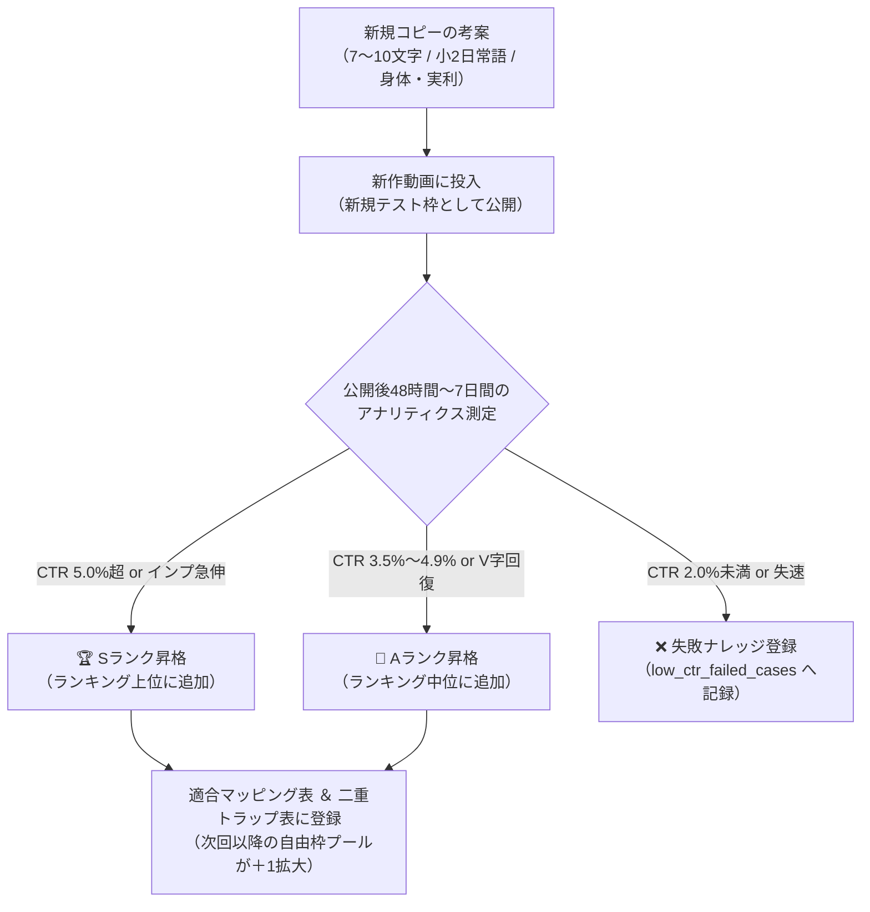

# 💎 サムネイル「気持ち代弁・実利」勝ちパターン累計ランキング＆運用台帳
（YouTubeアルゴリズム・実測アナリティクスに基づくRAG参照用ナレッジベース / ポモスタ専用）

**ドキュメント種別**: サムネイル1行目コピー専用 勝ちパターン累計ランキング＆イラスト適合マッピング台帳  
**対象チャンネル**: 「ポモスタ（Pomodoro Study）」専用  
**KPI目標**: CTR 5.0%以上突破・維持 ＆ インプレッション最大化 ＆ バナーブラインドネス完全防止  
**最終更新日**: 2026-09-22（実測定量データ追加 ＆ 無限拡張ランキング昇格システム新設版）

---

## 🏆 第1章：実戦実証済み！差し替え・初速で爆発した【真の殿堂入り実績】

40本以上の配信実測データ、および直近の差し替えA/Bテストにおいて、**「インプレッションが垂直急伸した」「CTR 5.0%を突破した」「失速動画を劇的に再点火させた」実証済みの最強勝ちパターン**です。

### 🥇 1. 『疲れてても集中できる』（全肯定・救済型 / 確信度: 96%）
* **代表実績**: 秋の白樺書斎（ピアノ＆森の自然音版）
* **定量実績**: **インプ 8,771回（＋6,800回！） / 視聴 443回（＋413回！） / CTR 2.3%（差し替え前1.2%から約2倍へ急伸） / ユニーク 68名 / ブラウジング 74.3%へ急拡大！**
* **勝因**: 「疲れている自分」を責めず、そのまま再生すれば救済される安心感。条件提示を排しトップ画面を独占。

### 🥇 2. 『勉強の手が止まらない』（小2日常語 ✕ 身体受動型 / 確信度: 96%）
* **代表実績**: 秋の白樺書斎（音楽なし・森の自然音版）
* **定量実績**: **公開15時間で 415インプ / サムネイルCTR 5.5% 達成！**（最重要KPI 5.0%超えを一撃突破）
* **勝因**: 小2配当漢字（勉・強・手・止）による0.05秒の網膜直撃。ポモドーロ最大市場（学生・勉強層）を総取り。

### 🥇 3. 『誰にも邪魔されず集中』（不可侵聖域型 / 確信度: 94%）
* **代表実績**: 晩夏の森書斎（音楽なし・森の自然音版）
* **定量実績**: **インプ 5,743回 / 視聴 374回（音楽なし動画過去最多再生！） / CTR 3.5% / ブラウジング 59.4%**
* **勝因**: 「音楽のメロディすら邪魔」と感じる環境音派に120%合致。音楽なしでありながらトップ画面で約60%の配給を獲得。

### 🥇 4. 『気がつけば手が動く』（身体先行・自動操縦型 / 確信度: 90%）
* **代表実績**: 海の書斎（ピアノ＆波の音版）
* **定量実績**: **インプ 6,501回 / 視聴 941回（1,000再生目前！） / CTR 10.3%（初速〜中期累計） / 総再生時間 53時間突破！**
* **勝因**: 「海×朝光」のイラストと融合し、無理なく作業に入り込める心地よさを想起させロングヒット。

### 🥈 5. 『今日中に終わらせる』（締め切り焦燥・タスク清算型 / 確信度: 91%）
* **代表実績**: 海の書斎（音楽なし・波の音版）
* **定量実績**: **インプ 858回へ再点火（差し替え前623インプ停止から＋235回） / CTR 3.0%キープ / 平均視聴時間 56分33秒！**
* **勝因**: 連休終盤・夕方以降の「今日中に終わらせなきゃ」という切迫感とシンクロ。1時間近く完走する高エンゲージ層を獲得。

---

## 🎨 第2章：勝ちパターン累計ランキング ＆ イラスト適合マッピング台帳（定量データ付き）

新しいコピーを都度テストし、成果が出たものを順次ランキングへ昇格・追加していきます（10件に限定せず11件、12件…と無限拡張）。  
背景イラストの空間イメージ・光・世界観に合わせて、最適なコピーを選定します。

| Rank | サムネイル1行目コピー | 文字数 | 強調色 | 最高インプ | 最高CTR | 測定状況・実績根拠 | 適合するイラスト空間・ビジュアルイメージ | 最適ターゲット・時間帯 |
| :---: | :--- | :---: | :---: | :---: | :---: | :---: | :--- | :--- |
| **1位** | **勉強の手が止まらない** | 10文字 | **`手が止まらない`** (イエロー) | **415** (初速) | **5.5%** | 🟢 実戦実証済み (白樺・音楽なし版) | **天井までの本棚・図書館・開いた本とノートPC・真鍮ランプ**（学術的・知的好奇心を刺激するアカデミック空間） | テスト期間、受験直前期、連休昼、資格勉強層 |
| **2位** | **気がつけば手が動く** | 9文字 | **`手が動く`** (シアン/白) | **6,501** | **10.3%** | 🟢 実戦実証済み (海の書斎・ピアノ版 941再生) | **水平線が見える海の書斎・爽やかな朝の光・コーヒーカップ**（爽快感があり、スッと作業に滑り込める開放的空間） | 早朝、午前中の作業開始、PC作業・クリエイター |
| **3位** | **疲れてても集中できる** | 10文字 | **`集中`** (ゴールド) | **8,771** | **2.3%** (差し替え倍増) | 🟢 実戦実証済み (白樺・ピアノ版 443再生) | **暖色の照明・雨の窓辺・夕暮れ・暖炉・温かみのあるウッド書斎**（疲れた体を包み込むような落ち着いた空間） | 平日夜、日曜夕方、疲れが溜まった社会人・受験生 |
| **4位** | **誰にも邪魔されず集中** | 10文字 | **`集中`** (イエロー) | **5,743** | **3.5%** | 🟢 実戦実証済み (森書斎・音楽なし 374再生) | **深い森林・雨の隠れ家・山奥の別荘・個室キャレル・湖畔**（外界から完全に隔絶された秘密基地感のある空間） | リモートワーク、通知に疲れた層、自然音派 |
| **5位** | **今日中に終わらせる** | 9文字 | **`終わらせる`** (シアン/黄) | **858** | **3.0%** (AVD 56分) | 🟢 実戦実証済み (海の書斎・音楽なし版) | **夕暮れ・トワイライト・卓上時計・手元を照らすタスクライト**（刻一刻と時間が進む夕方〜夜のリアルな作業空間） | 締め切り前夜、日曜18時以降、駆け込み作業層 |
| **6位** | **やる事が全部片付く** | 9文字 | **`全部片付く`** (ゴールド) | ― | ― | 🟡 検証待ち (確信度 93% / 予測CTR 5.0%+) | **広々とした一枚板デスク・ミニマルモダンオフィス・整理整頓空間**（ノイズがなく、視界が開けたクリアな空間） | 週初め（月曜）、連休最終日、ToDoが溜まる全世代 |
| **7位** | **静寂の中で手が動く** | 9文字 | **`手が動く`** (ゴールド) | ― | ― | 🟡 検証待ち (確信度 91% / 音楽なし特化) | **和モダン・禅書斎・雪景色・夜の厳粛な石造り図書館**（無駄な装飾がなく、ピンと張り詰めた美しい静けさの空間） | 深夜の作業、執筆、デザイン、難解な論文読解層 |
| **8位** | **やる気ゼロでも集中** | 9文字 | **`集中`** (イエロー) | ― | ― | 🟡 検証待ち (確信度 92% / 予測CTR 4.5%+) | **北欧ナチュラル書斎・曇り空・柔らかな間接光・観葉植物**（気負わずに座れる、居心地の良いHyggeな空間） | 休日の朝、中だるみの昼下がり、先延ばし層 |
| **9位** | **無理せず自然と集中** | 9文字 | **`集中`** (グリーン/黄) | ― | ― | 🟡 検証待ち (確信度 90% / 癒やし特化) | **サンルーム・温室・ボタニカル書斎・柔らかな木漏れ日**（植物の緑に囲まれ、深呼吸したくなる癒やしの空間） | ストレス過多の社会人、心身を整えたい層 |
| **10位**| **一瞬でゾーンに入る** | 9文字 | **`ゾーン`** (イエロー) | ― | ― | 🟡 検証待ち (確信度 89% / 高単価特化) | **エグゼクティブ・CEO書斎・タワマン夜景・デュアルモニター**（洗練されたプロフェッショナルな知の最前線空間） | エンジニア、トレーダー、限界突破したい学生 |

> [!NOTE] ランキングの更新基準
> 新しいコピーを都度テストし、以下の基準を満たしたものは本ランキングに即座に追加・順位昇格します。
> * **Sランク殿堂入り（トップ昇格）**: CTR 5.0%以上を達成、または インプレッション5,000回以上かつCTR 3.0%以上を達成。
> * **Aランク採用（ランキング追加）**: CTR 3.5%以上を達成、または 差し替えによりインプレッション・再生数が2倍以上にV字回復。

---

## 🚫 第3章：バナーブラインドネス完全防止「直近4回クールダウン（使用禁止）ルール」

### 3.1 クールダウンルールの定義
同じサムネイルコピーが短期間に連続すると、登録者のフィードやチャンネル一覧で「同じ動画の重複」と見なされ、クリック率が急落（バナーブラインドネス）します。これを永久に防止するため、以下の鉄則を適用します。

> [!important] 4回インターバル・ローテーションの掟
> **直近4本の動画で使用されたサムネイルコピーは、以後の4回は使用を禁止（クールダウン）とする。**  
> ランキングの上位から選ぶ際も、必ず「現在クールダウン中ではない残りの候補（自由枠プール）」の中から、背景イラストに最も調和するコピーを選定すること。  
> 勝ちパターンが10件、15件、20件と増えるほど、自由枠プールの選択肢が広がり、チャンネルの表現力とクリック率が恒常的に高まります。

### 3.2 直近の利用履歴 ＆ 次回選定プール（トラッキング台帳）

| 公開順 | 動画タイトル（テーマ） | 採用サムネイルコピー | クールダウン状態（次回以降） |
| :---: | :--- | :--- | :---: |
| **直近-3** | 海の書斎（ピアノ版） | `気がつけば手が動く`（Rank 2位） | 🔒 **使用禁止**（あと1回で解禁） |
| **直近-2** | 白樺書斎（ピアノ版） | `疲れてても集中できる`（Rank 3位） | 🔒 **使用禁止**（あと2回で解禁） |
| **直近-1** | 海の書斎（音楽なし版） | `今日中に終わらせる`（Rank 5位） | 🔒 **使用禁止**（あと3回で解禁） |
| **最新** | **白樺書斎（音楽なし版）** | **`勉強の手が止まらない`**（Rank 1位） | 🔒 **使用禁止**（あと4回で解禁） |

#### 🟢 次回動画（次回リリース時）に選定可能な「自由枠プール（Rank上位順）」
次回作の背景イラストに合わせて、ロックされていない以下の候補（＋新規テスト枠）から選定可能です。
1. **`誰にも邪魔されず集中`**（Rank 4位 / 確信度 94% / 森・隠れ家・山奥・夜景に最適 / 実績5,700インプ）
2. **`やる事が全部片付く`**（Rank 6位 / 確信度 93% / モダンオフィス・広々デスクに最適）
3. **`静寂の中で手が動く`**（Rank 7位 / 確信度 91% / 和モダン・禅・雪景色・深夜図書館・音楽なしに最適）
4. **`やる気ゼロでも集中`**（Rank 8位 / 確信度 92% / 北欧ナチュラル・曇り空・カフェ風に最適）
5. **`無理せず自然と集中`**（Rank 9位 / 確信度 90% / ボタニカル・サンルーム・木漏れ日に最適）
6. **`一瞬でゾーンに入る`**（Rank 10位 / 確信度 89% / CEOオフィス・タワマン夜景に最適）
7. **【新規テスト枠】**（都度試したい新しいコピーを自由に投入可能）

---

## 🧪 第4章：新規コピーの「都度テスト ＆ ランキング昇格」運用フロー

新しいコピーを試す際は、以下の手順で安全にテストし、勝ちパターンを拡充していきます。

1. **テスト投入のルール**:
   * 直近4回で使用されていない言葉であれば、思いついた魅力的なコピーを「新規テスト枠」として随時投入してOK。
2. **アナリティクス判定（48h〜7日）**:
   * **合格ライン（CTR 4.0%以上、またはCTR 3.0%以上かつ高インプレッション）**: 勝ちパターンとして認定し、定量データ（インプ、CTR、測定状況）をマッピング表に記録。
   * **不合格ライン（CTR 2.0%未満でインプ停止）**: [low_ctr_failed_cases_database.md](file:///Users/ymto/Documents/git/bgm-channel-ops/docs/low_ctr_failed_cases_database.md) に失敗要因を記録し、本命勝ちパターンへ即座に差し替え（ピボット）。
3. **ランキングの自動拡張**:
   * 10件を超えた場合、Rank 11位、12位…と表の下または該当する実績順位の位置に追記し、選択肢を増やしていきます。

---

## ⚙️ 第5章：差し替え（ピボット）成功の4大黄金法則

動画公開後にインプレッションが失速した際、CTRをV字回復させるための鉄則です。

1. **条件提示（〜なら）から「全肯定・救済」への転換**:
   * ❌「雑念ゼロで即集中」（条件を要求する言葉） ➔ ⭕️「疲れてても集中できる」（ダメな現状のままでOK）
2. **抽象語から「小学生レベルの平易日常語（小2漢字）」への純化**:
   * 難しい漢字や抽象的な概念（雑念、邪魔、脱力）を避け、0.05秒で反射認識できる日常身体語（手、止まらない、片付く、勉強）を使う。
3. **音楽なし版のバナーブラインドネス打破**:
   * ピアノ版と同じ背景画像を使う場合、文字の流用は絶対禁止。必ず別角度の特化コピーにする。
4. **二重トラップの完全性（同語反復ゼロ）**:
   * サムネイルで「身体・感情」、タイトル頭15文字で「環境・最高の実利」を提示し、異なる2つの動機でクリックを誘発する。

---

## 🔄 第6章：サムネイル × タイトルの「二重トラップ」黄金マトリクス

サムネイル（気持ち代弁・身体先行）とタイトル先頭15文字（最高峰の実利・環境確約）で**同語反復を完全排除し、2つの異なる角度からタップを誘発**します。

| サムネイル1行目（本命コピー） | ❌ NGタイトル先頭（同語反復） | ⭕️ 黄金タイトル先頭（二重トラップ） | 補完・増幅のメカニズム |
| :--- | :--- | :--- | :--- |
| **`勉強の手が止まらない`** | `【勉強の手が止まらない】...` | **`【誰にも邪魔されない】音楽なし 森の自然音...`** | サムネで「学生・全世代の勉強」を網羅し、タイトルで「不可侵の聖域・音楽なし」を保証。 |
| **`気がつけば手が動く`** | `【気がつけば手が動く】...` | **`【自然と集中できる】波の音＆ピアノ...`** | サムネで「身体の自動スタート」を促し、タイトルで「リラックス集中」を保証する。 |
| **`疲れてても集中できる`** | `【疲れてても集中】森の...` | **`【やる事が片付く】森の音＆ピアノ...`** | サムネで「疲労の救済」を与え、タイトルで「タスク完了の確定成果」を提示して睡眠誤認をブロック。 |
| **`誰にも邪魔されず集中`** | `【誰にも邪魔されず】...` | **`【ゾーンに入る】音楽なし 森の自然音...`** | サムネで「孤独・安心感」を与え、タイトルで「最高峰の集中状態（ゾーン）」へ引き上げる。 |
| **`今日中に終わらせる`** | `【今日中に終わらせる】...` | **`【頭スッキリ】音楽なし 波の音...`** | サムネで「締め切り焦燥」を代弁し、タイトルで「終わった後の爽快感」を約束する。 |
| **`やる事が全部片付く`** | `【やる事が片付く】...` | **`【ゾーンに入る】音楽なし 森の自然音...`** | サムネで「ToDoの清算」を約束し、タイトルで「集中クオリティの高さ」をダメ押しする。 |
| **`静寂の中で手が動く`** | `【静寂の中で手が動く】...` | **`【一気に進む】雪の音＆ピアノ...`** | サムネで「静謐な集中空間」を提示し、タイトルで「驚異的な進捗スピード」を約束する。 |
| **`やる気ゼロでも集中`** | `【やる気ゼロでも集中】...` | **`【頭がスッキリする】自然音＆ピアノ...`** | サムネで「脱力・怠惰の救済」を受け取った脳に、タイトルで「脳の爽快感」を提示する。 |
| **`無理せず自然と集中`** | `【無理せず集中】...` | **`【心が整う】木漏れ日＆ピアノ...`** | サムネで「ストレスフリー」を約束し、タイトルで「自律神経の調律」を提示する。 |
| **`一瞬でゾーンに入る`** | `【一瞬でゾーンに】...` | **`【作業が一気に進む】夜景＆ピアノ...`** | サムネで「最高峰の集中状態」へ誘い、タイトルで「圧倒的成果」をダメ押しする。 |
